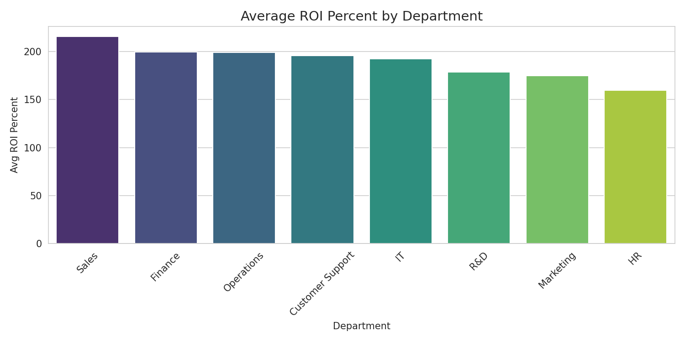
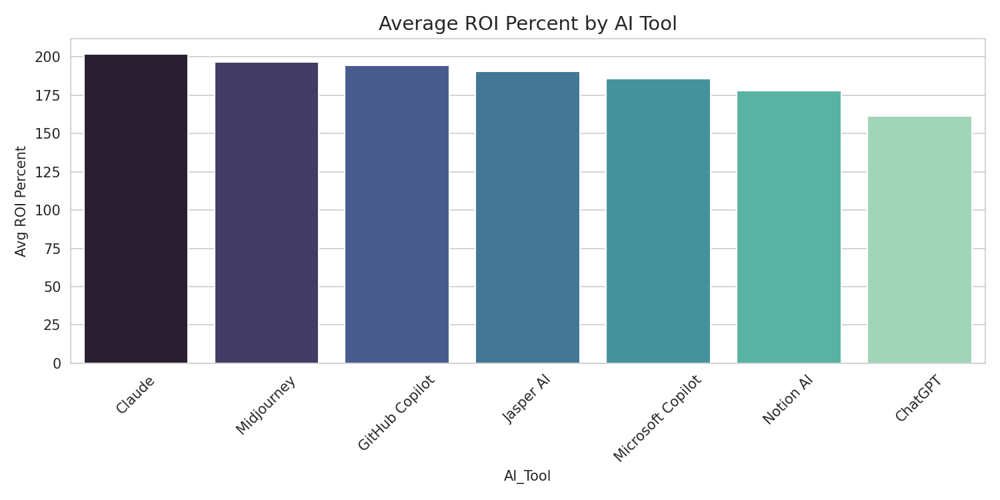
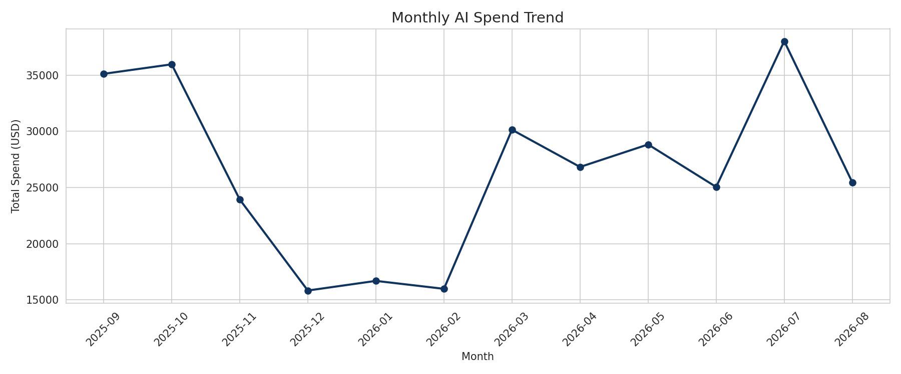
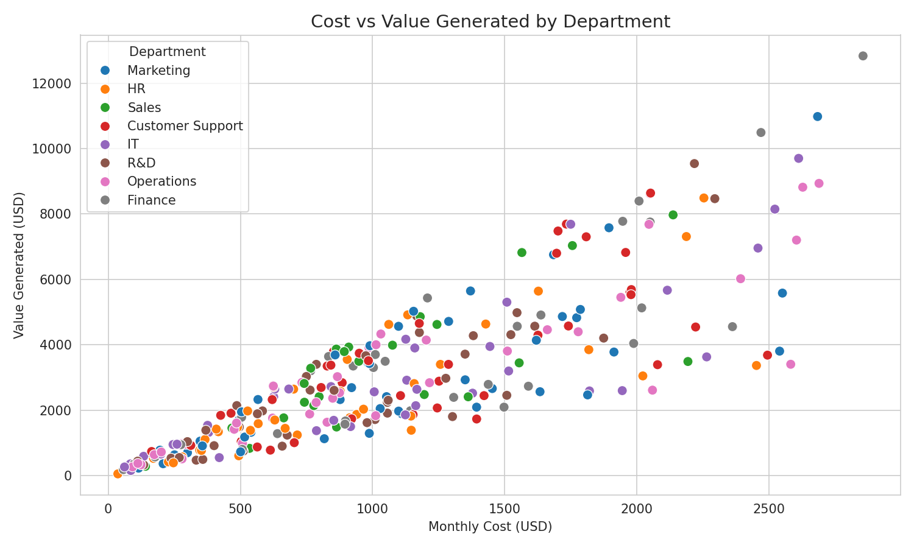
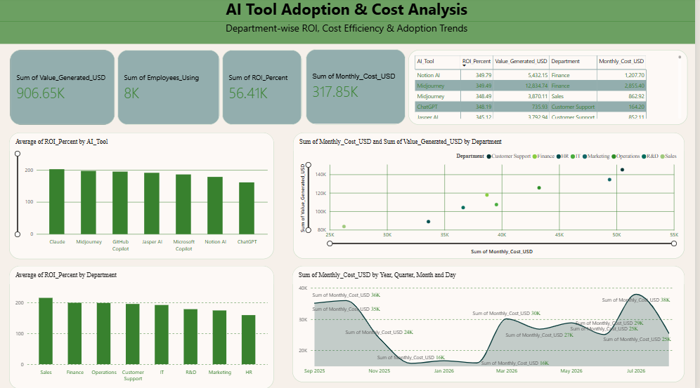

# AI Tool Adoption & Cost Analysis
A data analytics project examining how different business departments adopt AI tools, what they cost, and the return on investment (ROI) each department generates — using SQL, Python, and Power BI.
## 📌 Project Overview
Businesses today are rapidly adopting AI tools (ChatGPT, Copilot, Claude, etc.) across departments, but few track whether the cost is actually justified by the value generated. This project simulates a realistic company dataset to answer:
- Which departments get the best ROI from AI tools?
- Which AI tools perform best in terms of cost-efficiency?
- How has AI adoption spending trended over time?
- Where should the business reallocate its AI budget?
## 🛠️ Tools & Technologies
- **Python** — Data generation (pandas, Faker), analysis
- **SQL (SQLite)** — Querying and aggregating business metrics
- **Matplotlib / Seaborn** — Data visualization
- **Power BI** — Interactive dashboard
- **Google Colab** — Development environment
## 📂 Repository Structure
- **data/** — ai_tool_adoption_data.csv (Simulated dataset, 300 records)
- **charts/** — chart1_dept_roi.png, chart2_tool_roi.png, chart3_monthly_trend.png, chart4_cost_vs_value.png
- **insights_report.txt** — Full written business insights
- **AI_Tool_Adoption_Cost_Analysis_Dashboard.pbix** — Power BI dashboard file
- **dashboard_screenshot.png** — Dashboard preview image
## 📊 Dataset
A simulated dataset of 300 records covering 8 departments and 7 AI tools, including:
- Department, AI Tool, Month
- Employees Using the Tool
- Monthly Cost (USD)
- Hours Saved per Week
- Tasks Automated
- Value Generated (USD)
- Calculated ROI (%)
## 🔍 Key Insights
1. **Sales** delivers the highest average ROI (215.66%) with relatively low total spend — the most efficient department.
2. **HR** shows the lowest ROI (159.64%), suggesting AI tools may not be well-matched to its tasks yet.
3. **Claude** and **Midjourney** are the top-performing tools by ROI, while **ChatGPT** — despite being the most widely used — has the lowest average ROI.
4. AI spend follows a **seasonal pattern**, peaking around Sep–Oct and July, with dips between Nov–Feb — likely tied to fiscal budget cycles.
5. High cost-per-employee does not always mean high ROI (e.g., Finance has the highest per-employee cost but not the best ROI).
**Recommendation:** Reallocate part of the AI budget from lower-ROI departments (HR, Marketing) toward tools and practices proven successful in Sales and Finance, and standardize on higher-ROI tools like Claude and GitHub Copilot where possible.
Full write-up in [`insights_report.txt`](./insights_report.txt).
## 📈 Visualizations
**Average ROI by Department**

## 📊 Interactive Power BI Dashboard
A fully interactive dashboard was built on the same dataset, featuring KPI cards, a department slicer, and a top-5 ROI table alongside the core visualizations.

Download the full interactive file: [`AI_Tool_Adoption_Cost_Analysis_Dashboard.pbix`](./AI_Tool_Adoption_Cost_Analysis_Dashboard.pbix)
